# Agent IR — Specification v0.1

**A compilation infrastructure for agentic systems**

Status: working draft — subject to major revision before v1.0
Scope: conceptual specification + reference architecture + Rust implementation plan

---

## 0. Methodological disclaimer

This document tries to follow the discipline of a compiler specification (MLIR-style) rather than that of a product pitch. Three rules apply throughout:

1. **No unmeasured performance claims.** Every announced gain (tokens, latency, cost) is conditional and must be verified by the benchmark harness defined in §9.
2. **No optimization pass is "safe by default".** A pass is applied only if its validity conditions (defined pass by pass) are satisfied by the current IR program.
3. **The LLM is never an authority on real effects.** It proposes; the IR + the verifier decide.

The main friction point of this whole project — and the real potential scientific contribution — is not the syntax. It is the **type and effect system** that makes it possible to know, before execution, whether a transformation or an action is safe. Without that, "Agent IR" is just a pretty serialization format for trajectories. This document therefore puts the type/effect system at the center, ahead of dialects and ahead of passes.

---

## 1. Conceptual model

### 1.1 Definition of an agentic program

```
AgentProgram :=
    Intent
  + Context
  + State
  + Actions
  + ControlFlow
  + Observations
  + Memory
  + Constraints
  + Policies
  + Termination
```

An `AgentProgram` is a graph of values and operations in SSA form, organized as `Module → Region → Block → Operation → Value`, in the manner of MLIR — but with two extensions that do not exist in a classical compute IR:

- **Producer uncertainty**: an `Operation` can be proposed by an LLM with no guarantee of syntactic or semantic correctness. It must be validated before entering the module.
- **Non-replayable external effects**: unlike an arithmetic operation, a `tool.call` can have an observable side effect in the real world, non-undoable, and not bit-for-bit reproducible on re-execution.

These two properties silently break a large part of the intuition that "we can just reuse classical compiler passes". They are handled explicitly in §2 and §4.

### 1.2 Life cycle

```
IR₀ → compile → execute → observe → IR₁ → compile → execute → observe → IR₂ → ...
```

The IR is never frozen after a single pass. Each iteration produces a new versioned form (§8), and only the modified region is recompiled (incremental recompilation, §5.13).


---

## 2. Type, effect and capability system

This is the part I consider non-negotiable and higher priority than everything else. Without it, no optimization pass in this document is genuinely safe.

### 2.1 Value types

```
Type :=
    Scalar(Int | Float | Bool | String)
  | Tensor(shape, dtype)
  | Ref(ResourceId)
  | Observation(schema)
  | Plan
  | ToolResult(schema)
  | Memory
  | Unknown        // value produced by the LLM, not yet typed
```

`Unknown` exists explicitly because a plan produced by an LLM often contains values whose type can only be inferred after verification (e.g. a hallucinated tool identifier). The verifier (§3) must resolve every `Unknown` before the value can cross an effect boundary.

### 2.2 Effect system (the core differentiator)

Every `Operation` declares an **effect signature**, independently of its return type:

```
Effect :=
    Pure                     // no external interaction, replayable, cacheable
  | ReadExternal(scope)      // external read (web, file, API) — idempotent by nature
  | WriteExternal(scope)     // external write — non-idempotent unless proven otherwise
  | Irreversible             // non-undoable effect (payment, deletion, sending)
  | Stochastic               // non-deterministic output (LLM call, sampling)
```

This signature is what makes an optimization pass *decidable* rather than *heuristic*:

| Pass | Necessary condition on the effect |
|---|---|
| Dead Action Elimination | `Pure` or (`ReadExternal` and result proven unused) |
| Result Reuse / Caching | `Pure` or `ReadExternal` with a declared validity window |
| Parallelization | No pair of `WriteExternal` operations on the same `scope` |
| Speculative Execution | Never on `Irreversible`; `WriteExternal` only if undoable (compensation defined) |
| Action Fusion | Both operations must share the same effect class and the same `scope` |

Without this table, "Dead Action Elimination" or "Speculative Execution" as described in the initial vision are *dangerous-by-default* optimizations — an operation like `search_web` or `benchmark` looks pure but may carry a cost, a side effect (rate limit, remote log), or may simply not be deterministic. The effect system forces the question to be settled explicitly.

### 2.3 Capabilities and permissions

```
Capability :=
    name: String
    scope: Resource
    grants: [Effect]
    requires_approval: Bool
```

An `Operation` can only be lowered to the runtime if the agent holds a `Capability` covering its declared effect. This is the structural security boundary (§7).

### 2.4 Provenance

Every `Value` carries:

```
Provenance :=
    producer: OperationId
    source: LLM | Tool | User | Memory | Derived
    timestamp
    confidence: Float ∈ [0,1]   // 1.0 for reliable tool data, <1.0 for an LLM inference
    validity: Valid | Stale | Invalid | Archived
```

Provenance is what makes it possible to answer "why did this action happen" (§6 debugging) and to handle memory drift (§8.5).

---

## 3. IR structure

### 3.1 Hierarchy

```
Module
 └── Region
      └── Block
           └── Operation
                ├── operands: [Value]
                ├── results: [Value]
                ├── attributes: {key: Attribute}
                ├── effect: Effect
                └── regions: [Region]   // for if/loop/parallel
```

Identical in spirit to MLIR: SSA, nested regions, static attributes vs dynamic values (`Value`).

### 3.2 v0.1 dialects

The initial scope is deliberately limited to 5 dialects rather than defining 15:

```
core        — module, function, constant, cast
agent       — input, context, action, plan, return
control     — if, while, loop, parallel, branch
tool        — call, result, capability
memory      — read, write, search
observation — create, metric, error
```

`policy` and `communication` (multi-agent) are deliberately deferred to v0.2 — including them now would risk freezing a bad abstraction before a single agent works end to end.

### 3.3 Textual syntax (human-readable)

```mlir
module {
  agent.func @optimize_inference(%model: !tool.ref<model>, %hardware: !tool.ref<hw>) {

    %ctx = agent.context { objective = "latency", max_accuracy_loss = 0.01 }

    %model_info   = agent.action "inspect_model"(%model)     {effect = #pure}
    %hardware_info= agent.action "inspect_hardware"(%hardware){effect = #pure}

    control.parallel {
      %profile  = agent.action "profile"(%model, %hardware)  {effect = #read_external}
    }

    %candidates = agent.action "generate_candidates"(%profile) {effect = #stochastic}

    control.loop %c : !agent.candidate in %candidates {
      %result   = tool.call "benchmark"(%c)                  {effect = #read_external}
      %latency  = observation.metric %result, "latency"
      %accuracy = observation.metric %result, "accuracy"

      control.if (%accuracy < %ctx.max_accuracy_loss) {
        agent.reject %c
      }
    }

    agent.verify %selected : capability("select_model")
    agent.return %selected
  }
}
```

### 3.4 Verification invariants (excerpt)

- **I1** — Every consumed `Value` must have a unique dominating producer (classical SSA).
- **I2** — Every `Operation` with `effect = Irreversible` must be preceded by an `agent.verify` referencing a `Capability` covering that effect.
- **I3** — A `control.parallel` region cannot contain two `WriteExternal` operations on the same `scope`.
- **I4** — Every value with `Provenance.source = LLM` and `confidence < configured_threshold` must be verified before feeding an operation with a non-`Pure` effect.
- **I5** — Every `control.loop` must declare a termination guard (`max_iterations` or a provable progress condition) — otherwise it is rejected at verification time (§8.6, loop guards).

A program that violates an invariant is **not executed**; it is returned to the LLM Builder with the precise diagnostic (invariant number, offending operation).

---

## 4. The compiler: pipeline

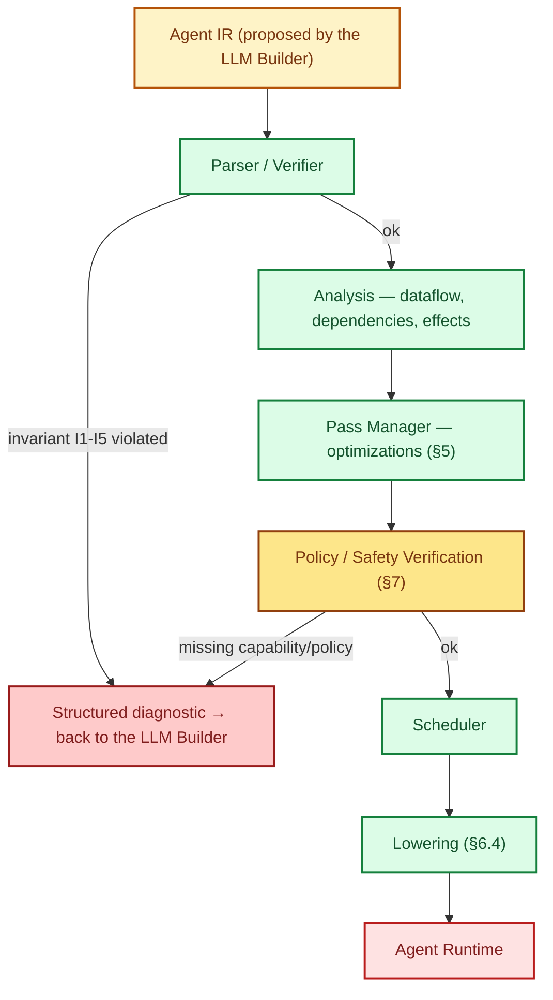

Every stage can fail and return a structured diagnostic rather than an opaque exception — this is what makes the system debuggable like a compiler rather than like a chain of prompts. The two explicit rejection points (syntactic/semantic verifier, and safety verification) are deliberately distinct: a program can be *well-formed* but *not authorized*.

---

## 5. Optimization passes — validity conditions and risks

For each pass: what it does, its validity condition **expressed in terms of the effect system**, and its risk if misapplied.

| Pass | Validity condition | Risk if violated |
|---|---|---|
| **Dead Action Elimination** | Result proven not consumed by any downstream operation (dataflow), and effect ∈ {Pure, ReadExternal} | Removal of a silently useful side effect (e.g. logging, cache warm-up) |
| **Dead Context Elimination** | Value absent from the dependency set of every remaining operation | Loss of information needed for a future decision not yet modeled |
| **Context Slicing** | The dependency graph is complete and up to date | Incorrect slice if the LLM can implicitly depend on context not modeled in the IR (a real risk — see the §5.1 note) |
| **Context Compaction** | Compaction is reversible, or the information loss is bounded and declared | A summary that hides data decisive for a future decision |
| **Relevant Memory Selection** | Relevance score computed against the current query, not a static keyword | Forgetting a memory that is relevant but phrased differently |
| **Observation Filtering** | Filter on declared relevance, never on freshness alone | Removal of an anomaly that looked like noise |
| **Tool Description Pruning** | The relevant tool subset is derived from the validated plan, not guessed in advance | The LLM can no longer change strategy if it does not have the tool in its context |
| **Tool Call Deduplication** | Effect ∈ {Pure, ReadExternal}, same arguments, and validity window not expired | Reuse of a stale result (e.g. price, system state) |
| **Result Reuse / Caching** | Effect ∈ {Pure, ReadExternal}, cache key = (name, arguments, scope) | Same — staleness |
| **Reasoning Reuse** | Two reasoning subgraphs proven semantically identical (not just textually identical) | False similarity positive → reuse of reasoning that does not apply |
| **Redundant Reasoning Elimination** | The redundant reasoning's result proven non-divergent | Loss of diversity that was useful for a candidate set |
| **LLM Call Elimination** | The decision can be derived deterministically from the IR (e.g. an explicit rule) | Substituting a judgment for reasoning — dangerous if the rule is poorly calibrated |
| **Prompt Minimization** | No removed information is referenced by a downstream operation | Silent degradation of reasoning quality |
| **Action Fusion** | Same effect class, same scope, sequentiality proven mandatory | Fusing two actions that had to remain separately observable (audit) |
| **Parallelization** | I3 (no write conflict on the same scope) | Race condition on a shared external resource |
| **Speculative Execution** | Never on `Irreversible`; requires a defined compensating action for any `WriteExternal` | A non-undoable side effect executed on the basis of a false hypothesis |
| **Checkpoint Optimization** | The state store guarantees snapshot consistency (no partial checkpoint) | Resuming from an inconsistent state |
| **Incremental Recompilation** | The unmodified region is proven unaffected by the new observations | Using an obsolete plan in a region assumed to be "unchanged" |

**Critical note (§5.1):** *Context Slicing* is the most seductive and the riskiest pass of the lot. An LLM can make implicit inferences from signals not modeled in the explicit dependency graph (style, tone, indirect mention). Until we have an empirical measure of how frequent these "invisible" dependencies are, this pass must remain **conservative by default** (over-inclusion rather than under-inclusion), with the token budget as a tuning constraint rather than the other way around.

---

## 6. Execution semantics, lowering and system boundaries

### 6.1 Separation of responsibilities

| Component | Responsibility | Does NOT do |
|---|---|---|
| LLM | Propose intent/plan | Decide whether an action executes |
| Agent IR | Represent the program | Execute anything |
| Compiler | Analyze/optimize/verify | Know target runtime details |
| Runtime | Execute the lowered plan | Reinterpret or modify the plan |
| Model Runtime | Serve inference | Decide safety policies |
| Tool Runtime | Execute tool calls | Bypass declared capabilities |
| Memory Runtime | Store/retrieve | Decide relevance (that is a pass) |

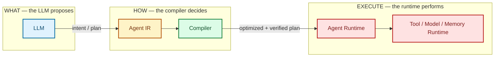

### 6.2 Why this is not "yet another agent framework"

An agentic framework (LangGraph, OpenClaw, etc.) defines *how to execute* an agent loop. The Agent IR defines *a formal representation independent of execution*, onto which several frameworks can project (lower) their own execution. This is the difference between a programming language and its interpreter — one IR can have several backends.

### 6.3 Comparison with existing work (honest, without inventing precedents)

| Domain | What exists | What is still missing |
|---|---|---|
| Compilers (LLVM/MLIR) | SSA, dialects, passes, lowering | Not designed for probabilistic reasoning or non-replayable external effects |
| Workflow engines (Temporal, Airflow, Prefect) | Durability, retries, checkpoints, DAG | No representation of LLM reasoning, no context/token optimization |
| Agentic frameworks (LangGraph, OpenClaw, CrewAI) | Agent loops, state machines | The "plan" stays largely implicit/dynamic, rarely a typed and verifiable IR |
| "Trajectory" formats (agent traces, structured logs) | Replay/observability formats | Not designed to be *compiled* — they are logs, not programs |

**The project's real differentiator**: the combination of (a) an MLIR-style typed and verifiable IR, (b) an effect/capability system that makes optimizations decidable rather than heuristic, and (c) treating the LLM as an unreliable proposer whose output must be formalized before earning the right to execute. None of the systems above combines all three.

### 6.4 Lowering

```
agent.action "search"(...)   →   runtime.tool_call(tool="web_search", ...)
agent.action "run_model"(...) →  runtime.inference(model=..., backend="vllm")
```

Each backend (OpenClaw, LangGraph, generic runtime) implements a lowering table `AgentOp → RuntimeOp`. The compiler never knows the details of a specific backend.

---

## 7. Safety as a structural property

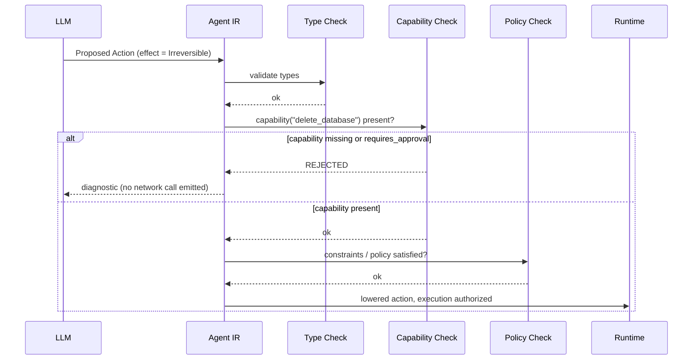

An action with an `Irreversible` effect and no matching `Capability`, or one requiring `requires_approval = true`, is **rejected at compile time**, before any network call. A concrete example:

```mlir
tool.call "delete_database"(%db) {effect = #irreversible}
// Verification fails: capability "delete_database" missing
// → REJECTED at compile time, never handed to the runtime
```

This is the central guarantee that can be sold to enterprises: **the LLM can never reach the real world without crossing a statically verifiable type boundary.**

---

## 8. Durable agent execution

### 8.1 Strict separation

```
Working Context   — what is sent to the LLM right now (bounded)
Operational State — what the agent is doing right now
Session Memory    — relevant to the current session
Long-Term Memory  — relevant beyond the session
Event Log         — what actually happened (immutable, append-only)
Archive           — beyond the active window
```

### 8.2 Infrastructure components

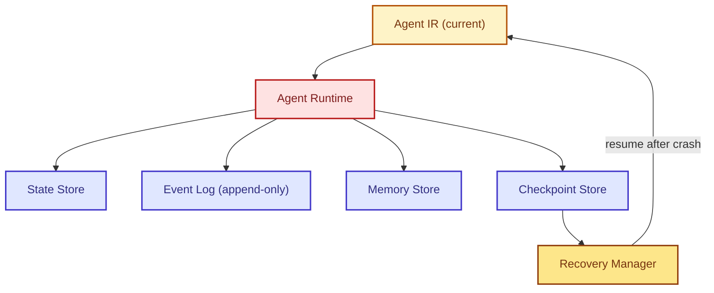

### 8.3 Idempotency

Every operation with a `WriteExternal` or `Irreversible` effect carries an `idempotency_key` derived from (module_id, operation_id, attempt). The runtime asks the Tool Runtime before re-execution: "does this operation already have a recorded result for this key?"

### 8.4 Loop guards

Detection of a `(same action, same arguments, same state)` pattern repeated beyond a threshold → triggers `RETRY_WITH_BACKOFF`, `CHANGE_STRATEGY` or `HUMAN_REVIEW` depending on policy.

### 8.5 Memory drift

Every memory entry has `validity ∈ {Valid, Stale, Invalid, Archived}` and an optional `expiration`. A memory never silently becomes "truth" — it is re-evaluated on every read if its `confidence` is below a threshold.

### 8.6 Crash recovery

```
CRASH → Recovery Manager → last valid Checkpoint → state validation → resume
```

IR versioning (`IR₀, IR₁, IR₂...`) makes it possible to replay exactly the sequence of transformations since the last checkpoint, without restarting the session.

---

## 9. Cost model and benchmarks

### 9.1 Cost model

```
Cost = α·input_tokens + β·output_tokens + γ·llm_calls + δ·tool_calls + ε·latency (+ optional financial cost)
```

Constraints expressible in the IR:

```
agent.budget { token_budget = 8000, latency_budget = 5s, cost_budget = 0.10usd, quality_threshold = 0.95 }
```

The scheduler looks for an execution strategy that minimizes `Cost` under these constraints — with no guarantee of finding the global optimum (a combinatorial problem, solved with heuristics at first).

### 9.2 What the IR can and cannot optimize directly

| Can optimize | Cannot optimize directly |
|---|---|
| Injected context (slicing, compaction, pruning) | The intrinsic quality of the LLM's reasoning |
| Number of redundant LLM calls | The model's own per-token cost |
| Tool call redundancy (cache, dedup) | The incompressible network latency of an external tool |
| Parallelism between independent actions | The truthfulness of an observation returned by a tool |
| Strategy choice under budget constraints | A model hallucination not structurally detectable |

### 9.3 Reference metrics

```
tokens / successful task     ← central metric (not tokens/request)
input tokens / task
output tokens / task
llm calls / task
tool calls / task
end-to-end latency
cost / task
success rate
recovery time (after crash)
context size over time (must stay bounded, not growing)
optimization overhead (the compiler's own cost — must stay << the gain)
```

### 9.4 Benchmark protocol

1. Define a reference **uncompiled** agent (naive LLM → tool loop) on a fixed task.
2. Run the same agent **compiled** through Agent IR, with the same tools available.
3. Compare on all the metrics of §9.3, over a sufficient sample of tasks (not a single run — LLM variance).
4. Publish the raw results, including the cases where the IR brings no gain or degrades latency (compiler overhead).

No gain figure is published anywhere else in this document until this protocol has been run.

---

## 10. Multi-agent model (v0.1 sketch, not frozen)

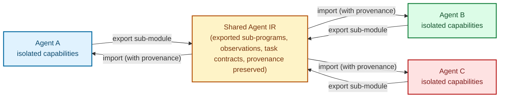

Each agent keeps its own `Capability` and `Memory` space; sharing happens through explicitly exported IR sub-modules, with provenance preserved across the boundary. This point is deliberately under-specified in v0.1 — the risk of freezing a bad coordination abstraction before having a single working agent outweighs the benefit of specifying it early.

---

## 11. Rust implementation architecture

```
agent-ir/
├── ir-core/          # Module, Region, Block, Operation, Value, Type, Attribute, Effect
├── dialects/
│   ├── core/  agent/  control/  tool/  memory/  observation/
├── parser/            # lexer, parser, printer (syntax of §3.3)
├── verifier/          # invariants I1-I5, structured diagnostics
├── analysis/          # dataflow, dependency-graph, effect-analysis
├── passes/            # one pass = one trait PassImpl { fn run(&self, &mut Module) -> Result<Diagnostics> }
├── pass-manager/       # orchestration, pass ordering, fixpoint
├── lowering/
│   ├── generic-runtime/  openclaw/  langgraph/
├── runtime/
│   ├── executor/  state-store/  event-log/  checkpoint-store/  recovery/
└── sdk/
    ├── rust/  python/
```

Core structures (sketch):

```rust
pub struct Value { id: ValueId, ty: Type, provenance: Provenance }

pub struct Operation {
    id: OperationId,
    dialect: DialectId,
    name: String,
    operands: Vec<ValueId>,
    results: Vec<Value>,
    attributes: HashMap<String, Attribute>,
    effect: Effect,
    regions: Vec<Region>,
}

pub trait Pass {
    fn name(&self) -> &str;
    fn run(&self, module: &mut Module, ctx: &AnalysisContext) -> Result<PassReport, Diagnostic>;
}
```

---

## 12. Roadmap

| Phase | Goal | Deliverable | Success criterion | Main risk |
|---|---|---|---|---|
| 0. Research/spec | This document, stabilized by critical review | Spec v0.1 frozen | Reviewed by 2-3 external peers | Freezing bad effect semantics too early |
| 1. Minimal IR | ir-core + `core` and `agent` dialects | Compilable Rust crate | An IR module can be built and printed | Over-generalizing before having a real use case |
| 2. Parser/Printer | Syntax of §3.3 | Round-trip text → IR → text | Round-trip idempotence | Ambiguous grammar |
| 3. Verifier | Invariants I1-I5 | Correct rejection of invalid programs | Negative test suite | False positives that block valid programs |
| 4. Analysis | Dataflow + dependency graph | Analysis API usable by the passes | Correct graph on 10 hand-written examples | Implicit dependencies not captured (§5.1) |
| 5. First passes | Dead Action Elimination, Parallelization (both with strict effect conditions) | 2 working passes + semantic non-regression tests | No pass alters the final result on the test bench | False security — believing a pass is safe without proof |
| 6. Runtime | Executor + generic lowering | A simple agent runs end to end | Full loop IR → execution → observation → IR' | Underestimating the real complexity of lowering |
| 7. Persistence/Recovery | State store, event log, checkpoints | Recovery after a simulated crash | Exact resume with no duplicated effect | Badly implemented idempotency |
| 8. Benchmarks | Protocol of §9.4 | Published results, including negative ones | Reproducible comparison naive vs compiled agent | Selection bias in the benchmark tasks |
| 9. SDKs | Rust + Python | API usable outside the repo | A third party builds a simple agent with the SDK | Unstable API that discourages adoption |
| 10. Multi-backends | OpenClaw/LangGraph lowering | The same agent runs on 2 backends | Equivalent result on both | Divergent lowering semantics |
| 11. Ecosystem | Documentation, governance, external contributions | Active community | Non-core contributions merged | Spec drift without an RFC process |

---

## 13. Full compilation example — before / after

### 13.1 Simple agent

Goal: "Inspect the model and the hardware, then profile them."

**IR₀ — initial plan proposed by the LLM (sequential, unoptimized):**

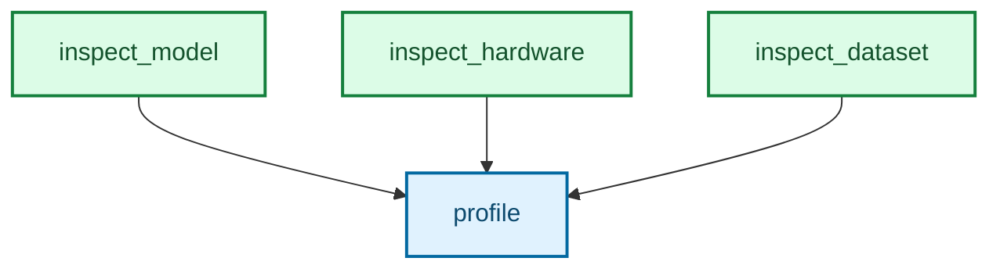

The LLM proposed an implicit sequential chain (emission order = execution order), without expressing any parallelism.

**Dependency analysis:** `inspect_model`, `inspect_hardware`, `inspect_dataset` all have a `Pure` effect, and none of their results is consumed by another — only `profile` depends on all three.

**IR₁ — after the *Parallelization* pass (condition I3 satisfied: no `WriteExternal` conflict):**

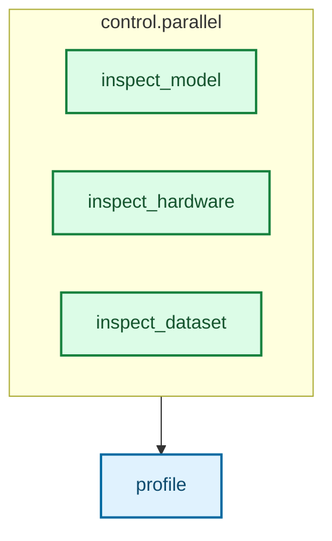

Expected gain (to be measured, §9.4): latency ≈ `max(t_A, t_B, t_C)` instead of `t_A + t_B + t_C`. No token change here — this is a pure latency gain, not an LLM cost gain.

### 13.2 Complex agent — candidate selection loop with observation

Picks up the example from §3.3 (`optimize_inference`). Full trace of one session:

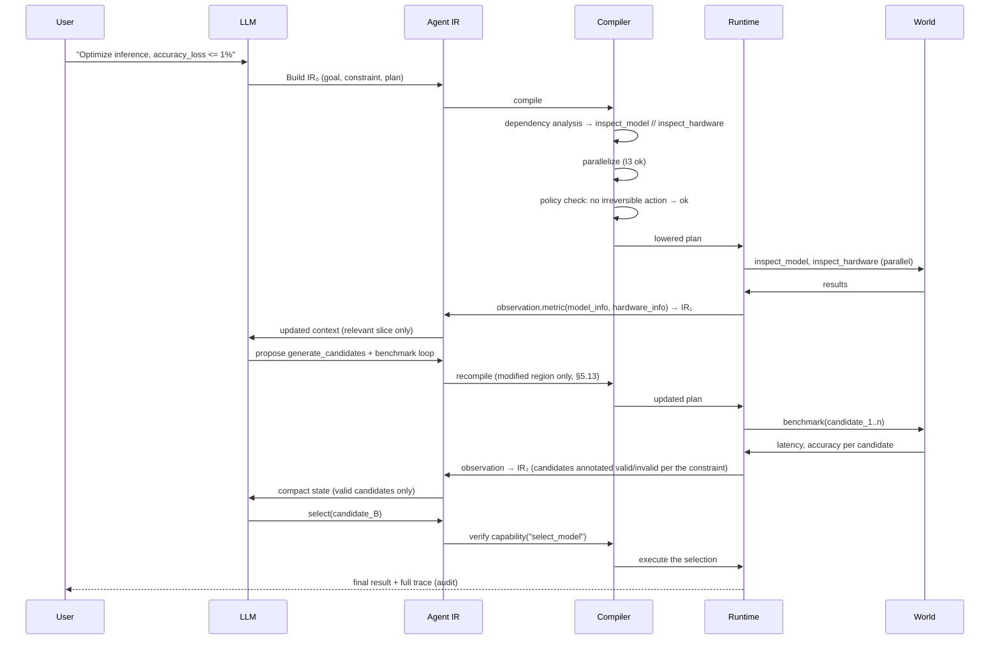

The point to note: at every turn, the LLM never sees the full history again — only the relevant *slice* computed by the compiler (§5, Context Slicing), with the caution stated in §5.1.

---

## 14. Verification model

The verifier runs in two distinct phases, matching the two rejection points of the pipeline (§4):

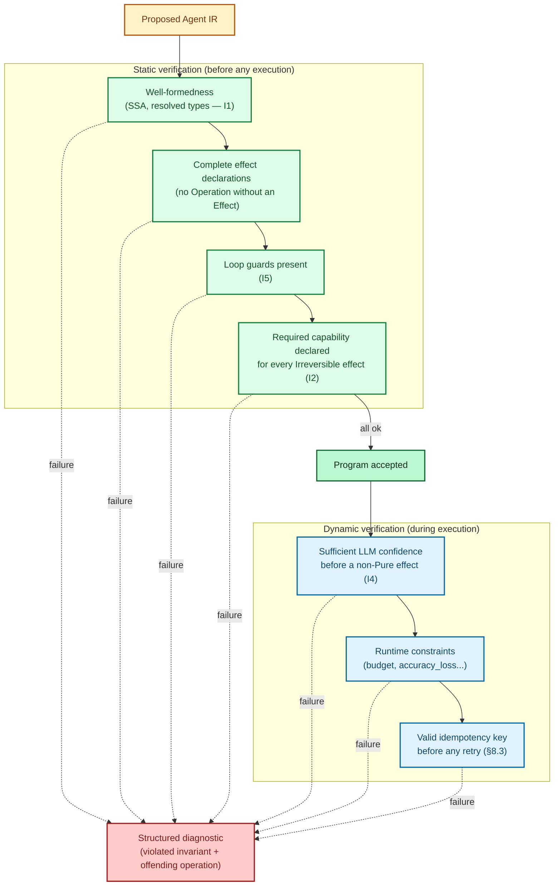

**Why separate static and dynamic:** a program can be well-formed and authorized at compile time (static) yet become invalid at execution time if an observation changes the state (e.g. a candidate exceeds `accuracy_loss` after benchmarking — that was not decidable before actually running it). The dynamic verifier therefore runs on every new observation, not just once at the start.

**Structured diagnostic (format):**

```
Diagnostic {
    invariant: "I2",
    operation: OperationId(42),
    message: "effect=Irreversible without a matching capability",
    suggestion: "add agent.verify before this operation, or request human_approval",
}
```

---

## 15. Scheduling model

The scheduler takes the optimized plan (post Pass Manager) and produces a concrete execution order under the budget constraints of §9.1.

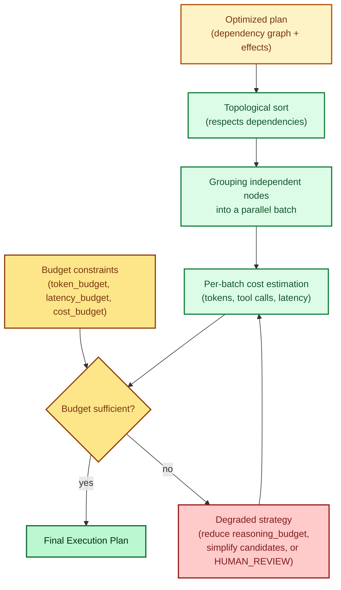

**A note on rigor:** the scheduler solves a combinatorial problem (scheduling under multi-objective constraints). In v0.1 we are not aiming for the optimum — a greedy heuristic (batch independent nodes in topological order, estimate the cost, degrade on overrun) is enough to validate the full loop. A real solver (e.g. constraint programming) is a research problem in its own right, out of scope for v0.1.

---

## 16. Long-running example — checkpoint and recovery

Scenario: an agent runs a benchmarking task over 40 candidates, spread across several hours, with a crash in the middle.

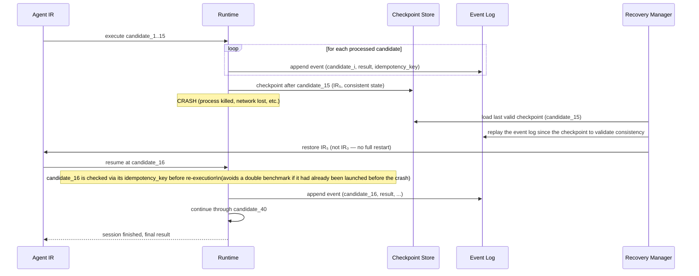

Key points illustrated:

- **No "start over from scratch"**: recovery starts from the last consistent checkpoint (§8.6), not from `IR₀`.
- **Idempotency key** (§8.3) protects against a double effect if the crash happened right after a `WriteExternal` whose acknowledgement was lost.
- **Append-only Event Log** serves both as the source of truth for recovery and as an audit trail (§6, debugging).

---

## 17. Long-term vision

```
Models / Frameworks / Applications
              │
      Universal Agent IR
              │
Compiler / Optimizer / Verifier / Scheduler
              │
      Multiple Runtimes
```
