# Agent IR — Specification v0.1

**A compilation infrastructure for agentic systems**

Status: working draft — subject to major revision before v1.0
Scope: specification, reference implementation in Rust, and a benchmark plan
Implementation: phases 0 to 9 of §12 are built and tested — see §18
Site: https://rustnew.github.io/Agent-IR/

---

## 0. Methodological disclaimer

This document tries to follow the discipline of a compiler specification (MLIR-style) rather than that of a product pitch. Three rules apply throughout:

1. **No unmeasured performance claims.** Every announced gain (tokens, latency, cost) is conditional and must be verified by the benchmark harness defined in §9.
2. **No optimization pass is "safe by default".** A pass is applied only if its validity conditions (defined pass by pass) are satisfied by the current IR program.
3. **The LLM is never an authority on real effects.** It proposes; the IR + the verifier decide.

The main friction point of this whole project — and the real potential scientific contribution — is not the syntax. It is the **type and effect system** that makes it possible to know, before execution, whether a transformation or an action is safe. Without that, "Agent IR" is just a pretty serialization format for trajectories. This document therefore puts the type/effect system at the center, ahead of dialects and ahead of passes.

A fourth rule has been added since the reference implementation was written: **where the code contradicted the specification, the specification was corrected.** Each such correction is marked *(corrected by the implementation)* at the point where it applies. A specification whose own worked example does not compile is a pitch, not a specification.

---

## 1. Conceptual model

### 1.1 Definition of an agentic program

```
AgentProgram :=
    Intent
  + Context
  + State
  + Actions
  + ControlFlow
  + Observations
  + Memory
  + Constraints
  + Policies
  + Termination
```

An `AgentProgram` is a graph of values and operations in SSA form, organized as `Module → Region → Block → Operation → Value`, in the manner of MLIR — but with two extensions that do not exist in a classical compute IR:

- **Producer uncertainty**: an `Operation` can be proposed by an LLM with no guarantee of syntactic or semantic correctness. It must be validated before entering the module.
- **Non-replayable external effects**: unlike an arithmetic operation, a `tool.call` can have an observable side effect in the real world, non-undoable, and not bit-for-bit reproducible on re-execution.

These two properties silently break a large part of the intuition that "we can just reuse classical compiler passes". They are handled explicitly in §2 and §4.

### 1.2 Life cycle

```
IR₀ → compile → execute → observe → IR₁ → compile → execute → observe → IR₂ → ...
```

The IR is never frozen after a single pass. Each iteration produces a new versioned form (§8), and only the modified region is recompiled (incremental recompilation, §5.13).


---

## 2. Type, effect and capability system

This is the part I consider non-negotiable and higher priority than everything else. Without it, no optimization pass in this document is genuinely safe.

### 2.1 Value types

```
Type :=
    Scalar(Int | Float | Bool | String)
  | Tensor(shape, dtype)
  | Ref(ResourceId)
  | Observation(schema)
  | Plan
  | ToolResult(schema)
  | Memory
  | Unknown        // value produced by the LLM, not yet typed
```

`Unknown` exists explicitly because a plan produced by an LLM often contains values whose type can only be inferred after verification (e.g. a hallucinated tool identifier). The verifier (§3) must resolve every `Unknown` before the value can cross an effect boundary.

### 2.2 Effect system (the core differentiator)

Every `Operation` declares an **effect signature**, independently of its return type:

```
Effect :=
    Pure                     // no external interaction, replayable, cacheable
  | ReadExternal(scope)      // external read (web, file, API) — idempotent by nature
  | WriteExternal(scope)     // external write — non-idempotent unless proven otherwise
  | Irreversible(scope)     // non-undoable effect (payment, deletion, sending)
  | Stochastic               // non-deterministic output (LLM call, sampling)
```

*(Corrected by the implementation: `Irreversible` originally carried no scope. It needs one, or invariant I3 cannot decide whether an irreversible write races a read of the same resource. An unnamed scope means "unknown", and an unknown scope conservatively overlaps every other — the effect system never guesses in the direction that would let an unsafe pass fire.)*

This signature is what makes an optimization pass *decidable* rather than *heuristic*:

| Pass | Necessary condition on the effect |
|---|---|
| Dead Action Elimination | `Pure` or (`ReadExternal` and result proven unused) |
| Result Reuse / Caching | `Pure` or `ReadExternal` with a declared validity window |
| Parallelization | No pair of `WriteExternal` operations on the same `scope` |
| Speculative Execution | Never on `Irreversible`; `WriteExternal` only if undoable (compensation defined) |
| Action Fusion | Both operations must share the same effect class and the same `scope` |

Without this table, "Dead Action Elimination" or "Speculative Execution" as described in the initial vision are *dangerous-by-default* optimizations — an operation like `search_web` or `benchmark` looks pure but may carry a cost, a side effect (rate limit, remote log), or may simply not be deterministic. The effect system forces the question to be settled explicitly.

### 2.3 Capabilities and permissions

```
Capability :=
    name: String
    scope: Resource
    grants: [Effect]
    requires_approval: Bool
```

An `Operation` can only be lowered to the runtime if the agent holds a `Capability` covering its declared effect. This is the structural security boundary (§7).

### 2.4 Provenance

Every `Value` carries:

```
Provenance :=
    producer: OperationId
    source: LLM | Tool | User | Memory | Derived
    timestamp
    confidence: Float ∈ [0,1]   // 1.0 for reliable tool data, <1.0 for an LLM inference
    validity: Valid | Stale | Invalid | Archived
```

Provenance is what makes it possible to answer "why did this action happen" (§6 debugging) and to handle memory drift (§8.5).

---

## 3. IR structure

### 3.1 Hierarchy

```
Module
 └── Region
      └── Block
           └── Operation
                ├── operands: [Value]
                ├── results: [Value]
                ├── attributes: {key: Attribute}
                ├── effect: Effect
                └── regions: [Region]   // for if/loop/parallel
```

Identical in spirit to MLIR: SSA, nested regions, static attributes vs dynamic values (`Value`).

### 3.2 v0.1 dialects

The initial scope is deliberately limited to 5 dialects rather than defining 15:

```
core        — constant, cast, cmp
agent       — func, input, context, action, plan, budget, verify, reject, return
control     — if, while, loop, parallel, yield
tool        — call, result, capability
memory      — read, write, search
observation — create, metric, error
```

*(Corrected by the implementation. Three changes.* `core.cmp` *was added: §3.3 writes* `control.if (%accuracy < %threshold)` *and without a comparison there is no way to produce the boolean that* `control.if` *consumes.* `control.yield` *was added: a region that produces a value has to say which one, or values escape their region and SSA breaks.* `control.branch` *was dropped from v0.1: everything else in the dialect is structured control flow, and keeping it that way is what lets the effect analysis of §5 reason about a region as a unit instead of solving dataflow over an arbitrary CFG.)*

Each operation also declares **which effect classes it is allowed to carry**. `core.constant` may only be `#pure`; `tool.call` may be anything external but never `#stochastic`; `agent.action` may be anything at all. That column is the structural half of the safety argument: without it, a program could label a payment `#pure` and walk past every §5 pass condition. `agent-ir dialects` prints the table.

`policy` and `communication` (multi-agent) are deliberately deferred to v0.2 — including them now would risk freezing a bad abstraction before a single agent works end to end.

### 3.3 Textual syntax (human-readable)

The syntax below is the one the reference implementation parses and prints, and the program is `examples/optimize_inference.air` — checked in, verified and executed by the test suite. Printing *is* the definition of the grammar: `print(parse(f)) == f` is asserted for every example, so the text here cannot drift from what the compiler accepts.

```
operation  := results? op-name string? operands? region* attr-dict? types? provenance?
results    := '%' ident (',' '%' ident)* '='
op-name    := ident '.' ident
operands   := '(' ('%' ident (',' '%' ident)*)? ')'
region     := '{' block+ '}'
block      := ('^' ident block-args? ':')? operation*
attr-dict  := '{' (ident '=' attr (',' ident '=' attr)*)? '}'
types      := ':' (type | '(' type (',' type)* ')')
```

*(Corrected by the implementation. The v0.1 draft wrote `control.if (%a < %b)` and `%ctx.field`, neither of which is an operation — they are an expression language smuggled into an operation grammar, and they do not round-trip. The comparison is now an explicit `core.cmp`, field access an explicit operand, and every operation has the same shape. The effect is printed on every operation rather than defaulted, because §14's static check T2 requires that no operation lack one and a default would make the omission invisible.)*

```mlir
module @inference version(0) {
  capability @benchmark scope("bench") grants(read_external)
  capability @host scope("host") grants(read_external)
  capability @llm scope(*) grants(stochastic)
  capability @profiler scope("profiler") grants(read_external)
  capability @select_model scope("registry") grants(read_external)

  agent.func "optimize_inference" {
  ^bb0(%model: !tool.ref<model>, %hardware: !tool.ref<hw>):
    %max_accuracy_loss = core.constant {effect = #pure, value = 0.01} : !core.float
    %ctx = agent.context(%max_accuracy_loss) {effect = #pure, objective = "latency"} : !agent.plan
    %model_info = agent.action "inspect_model"(%model) {effect = #read_external<host>} : !observation.observation<model>
    %hardware_info = agent.action "inspect_hardware"(%hardware) {effect = #read_external<host>} : !observation.observation<hw>
    %profile = control.parallel {
      %profiled = agent.action "profile"(%model, %hardware) {effect = #read_external<profiler>} : !observation.observation<profile>
      control.yield(%profiled) {effect = #pure}
    } {effect = #pure} : !observation.observation<profile>
    %candidates = agent.action "generate_candidates"(%profile) {effect = #stochastic} : !tool.ref<candidates> provenance(%candidates = llm confidence(0.7))
    agent.verify(%candidates) {effect = #pure, capability = "llm"}
    control.loop(%candidates) {
    ^bb0(%candidate: !tool.ref<candidate>):
      %result = tool.call "benchmark"(%candidate) {effect = #read_external<bench>} : !tool.result<benchmark>
      %latency = observation.metric "latency"(%result) {effect = #pure} : !core.float
      %accuracy = observation.metric "accuracy"(%result) {effect = #pure} : !core.float
      %breaks_constraint = core.cmp "gt"(%accuracy, %max_accuracy_loss) {effect = #pure} : !core.bool
      control.if(%breaks_constraint) {
        agent.reject(%candidate) {effect = #pure}
      } {effect = #pure}
    } {effect = #pure, max_iterations = 40}
    %selected = agent.action "select"(%candidates) {effect = #read_external<registry>} : !tool.ref<model>
    agent.verify(%selected) {effect = #pure, capability = "select_model"}
    agent.return(%selected) {effect = #pure}
  } {effect = #pure}
}
```

The `agent.verify` before the loop is not decoration: `%candidates` comes from the model with confidence 0.7, and invariant I4 refuses to let a value that unreliable feed anything that touches the world. The one before `agent.return` satisfies I2. Remove either and `agent-ir verify` rejects the program.

### 3.4 Verification invariants (excerpt)

- **I1** — Every consumed `Value` must have a unique dominating producer (classical SSA).
- **I2** — Every `Operation` with `effect = Irreversible` must be preceded by an `agent.verify` referencing a `Capability` covering that effect.
- **I3** — A `control.parallel` region cannot contain two `WriteExternal` operations on the same `scope`.
- **I4** — Every value with `Provenance.source = LLM` and `confidence < configured_threshold` must be verified before feeding an operation with a non-`Pure` effect.
- **I5** — Every `control.loop` must declare a termination guard (`max_iterations` or a provable progress condition) — otherwise it is rejected at verification time (§8.6, loop guards).

A program that violates an invariant is **not executed**; it is returned to the LLM Builder with the precise diagnostic (invariant number, offending operation).

---

## 4. The compiler: pipeline

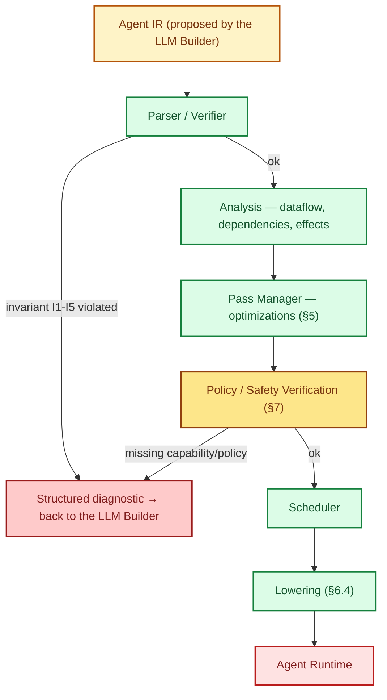

Every stage can fail and return a structured diagnostic rather than an opaque exception — this is what makes the system debuggable like a compiler rather than like a chain of prompts. The two explicit rejection points (syntactic/semantic verifier, and safety verification) are deliberately distinct: a program can be *well-formed* but *not authorized*.

---

## 5. Optimization passes — validity conditions and risks

For each pass: what it does, its validity condition **expressed in terms of the effect system**, and its risk if misapplied.

| Pass | Validity condition | Risk if violated |
|---|---|---|
| **Dead Action Elimination** | Result proven not consumed by any downstream operation (dataflow), and effect ∈ {Pure, ReadExternal} | Removal of a silently useful side effect (e.g. logging, cache warm-up) |
| **Dead Context Elimination** | Value absent from the dependency set of every remaining operation | Loss of information needed for a future decision not yet modeled |
| **Context Slicing** | The dependency graph is complete and up to date | Incorrect slice if the LLM can implicitly depend on context not modeled in the IR (a real risk — see the §5.1 note) |
| **Context Compaction** | Compaction is reversible, or the information loss is bounded and declared | A summary that hides data decisive for a future decision |
| **Relevant Memory Selection** | Relevance score computed against the current query, not a static keyword | Forgetting a memory that is relevant but phrased differently |
| **Observation Filtering** | Filter on declared relevance, never on freshness alone | Removal of an anomaly that looked like noise |
| **Tool Description Pruning** | The relevant tool subset is derived from the validated plan, not guessed in advance | The LLM can no longer change strategy if it does not have the tool in its context |
| **Tool Call Deduplication** | Effect ∈ {Pure, ReadExternal}, same arguments, and validity window not expired | Reuse of a stale result (e.g. price, system state) |
| **Result Reuse / Caching** | Effect ∈ {Pure, ReadExternal}, cache key = (name, arguments, scope) | Same — staleness |
| **Reasoning Reuse** | Two reasoning subgraphs proven semantically identical (not just textually identical) | False similarity positive → reuse of reasoning that does not apply |
| **Redundant Reasoning Elimination** | The redundant reasoning's result proven non-divergent | Loss of diversity that was useful for a candidate set |
| **LLM Call Elimination** | The decision can be derived deterministically from the IR (e.g. an explicit rule) | Substituting a judgment for reasoning — dangerous if the rule is poorly calibrated |
| **Prompt Minimization** | No removed information is referenced by a downstream operation | Silent degradation of reasoning quality |
| **Action Fusion** | Same effect class, same scope, sequentiality proven mandatory | Fusing two actions that had to remain separately observable (audit) |
| **Parallelization** | I3 (no write conflict on the same scope) | Race condition on a shared external resource |
| **Speculative Execution** | Never on `Irreversible`; requires a defined compensating action for any `WriteExternal` | A non-undoable side effect executed on the basis of a false hypothesis |
| **Checkpoint Optimization** | The state store guarantees snapshot consistency (no partial checkpoint) | Resuming from an inconsistent state |
| **Incremental Recompilation** | The unmodified region is proven unaffected by the new observations | Using an obsolete plan in a region assumed to be "unchanged" |

**What is implemented.** Three of these passes exist and are tested: *Dead Action Elimination* (which absorbs *Dead Context Elimination*), *Tool Call Deduplication* / *Result Reuse*, and *Parallelization*. Each refuses to fire when its condition is unmet, and each refusal has a test. The rest of the table is specification, not code, and is marked as such in §18.

Two of the conditions above needed sharpening once they were written down as code:

- *Result Reuse* says "validity window not expired". A compiler has no clock, so the implementation proves the stronger, decidable thing instead: **nothing between the two calls writes a scope either of them touches**. A read whose freshness depends on wall-clock time rather than on writes this program makes must opt out with `no_cache = true`.
- *Parallelization* fuses only operations that are **already adjacent**. Moving an operation across one it does not depend on is not safe from the dependency graph alone — shifting it earlier can jump it over a transitive predecessor, shifting it later over a successor — and this table says a pass fires when its condition is *satisfied*, not when it is plausible. The scheduler of §15 recovers the rest of the parallelism at execution time, where it orders execution instead of rewriting the program and every dependency edge still runs from an earlier batch to a later one.

**Critical note (§5.1):** *Context Slicing* is the most seductive and the riskiest pass of the lot. An LLM can make implicit inferences from signals not modeled in the explicit dependency graph (style, tone, indirect mention). Until we have an empirical measure of how frequent these "invisible" dependencies are, this pass must remain **conservative by default** (over-inclusion rather than under-inclusion), with the token budget as a tuning constraint rather than the other way around.

---

## 6. Execution semantics, lowering and system boundaries

### 6.1 Separation of responsibilities

| Component | Responsibility | Does NOT do |
|---|---|---|
| LLM | Propose intent/plan | Decide whether an action executes |
| Agent IR | Represent the program | Execute anything |
| Compiler | Analyze/optimize/verify | Know target runtime details |
| Runtime | Execute the lowered plan | Reinterpret or modify the plan |
| Model Runtime | Serve inference | Decide safety policies |
| Tool Runtime | Execute tool calls | Bypass declared capabilities |
| Memory Runtime | Store/retrieve | Decide relevance (that is a pass) |

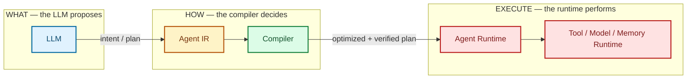

### 6.2 Why this is not "yet another agent framework"

An agentic framework (LangGraph, OpenClaw, etc.) defines *how to execute* an agent loop. The Agent IR defines *a formal representation independent of execution*, onto which several frameworks can project (lower) their own execution. This is the difference between a programming language and its interpreter — one IR can have several backends.

### 6.3 Comparison with existing work (honest, without inventing precedents)

| Domain | What exists | What is still missing |
|---|---|---|
| Compilers (LLVM/MLIR) | SSA, dialects, passes, lowering | Not designed for probabilistic reasoning or non-replayable external effects |
| Workflow engines (Temporal, Airflow, Prefect) | Durability, retries, checkpoints, DAG | No representation of LLM reasoning, no context/token optimization |
| Agentic frameworks (LangGraph, OpenClaw, CrewAI) | Agent loops, state machines | The "plan" stays largely implicit/dynamic, rarely a typed and verifiable IR |
| "Trajectory" formats (agent traces, structured logs) | Replay/observability formats | Not designed to be *compiled* — they are logs, not programs |

**The project's real differentiator**: the combination of (a) an MLIR-style typed and verifiable IR, (b) an effect/capability system that makes optimizations decidable rather than heuristic, and (c) treating the LLM as an unreliable proposer whose output must be formalized before earning the right to execute. None of the systems above combines all three.

### 6.4 Lowering

```
agent.action "search"(...)   →   runtime.tool_call(tool="web_search", ...)
agent.action "run_model"(...) →  runtime.inference(model=..., backend="vllm")
```

Each backend (OpenClaw, LangGraph, generic runtime) implements a lowering table `AgentOp → RuntimeOp`. The compiler never knows the details of a specific backend.

---

## 7. Safety as a structural property

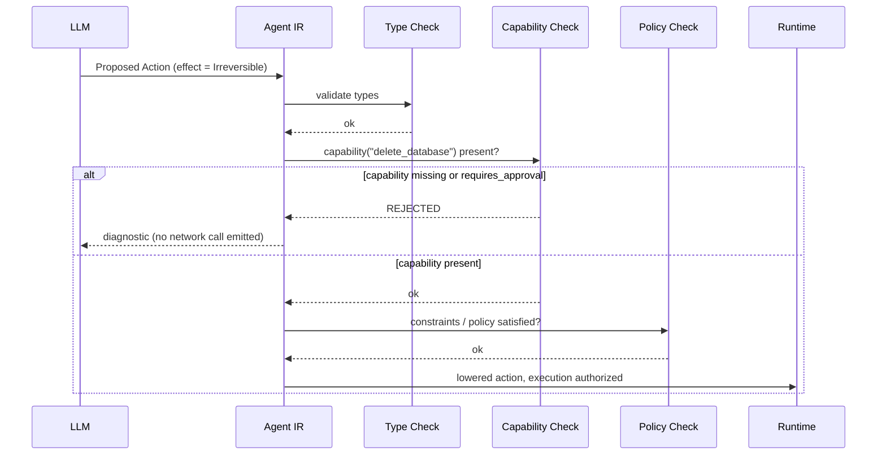

An action with an `Irreversible` effect and no matching `Capability`, or one requiring `requires_approval = true`, is **rejected at compile time**, before any network call. A concrete example:

```mlir
tool.call "delete_database"(%db) {effect = #irreversible}
// Verification fails: capability "delete_database" missing
// → REJECTED at compile time, never handed to the runtime
```

This is the central guarantee that can be sold to enterprises: **the LLM can never reach the real world without crossing a statically verifiable type boundary.**

---

## 8. Durable agent execution

### 8.1 Strict separation

```
Working Context   — what is sent to the LLM right now (bounded)
Operational State — what the agent is doing right now
Session Memory    — relevant to the current session
Long-Term Memory  — relevant beyond the session
Event Log         — what actually happened (immutable, append-only)
Archive           — beyond the active window
```

### 8.2 Infrastructure components

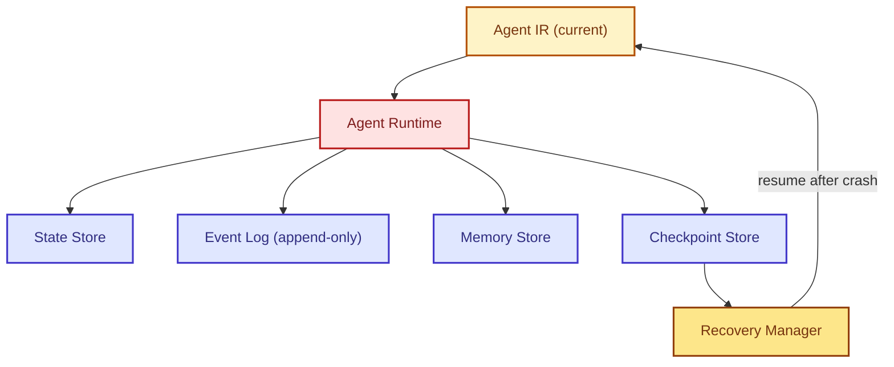

### 8.3 Idempotency

Every operation with a `WriteExternal` or `Irreversible` effect carries an `idempotency_key`. The runtime asks the Tool Runtime before re-execution: "does this operation already have a recorded result for this key?"

*(Corrected by the implementation.* A key derived from (module, operation, attempt) is not enough: the write inside a forty-iteration loop is *forty* effects, and one key for all of them would let recovery skip thirty-nine. The key therefore carries the **loop path** alongside the static half — module, version, operation. It stays stable across a replay because the plan does, including when the iterated list came from a model: a `#stochastic` call is non-replayable, so it carries a key of its own and is memoized rather than re-sampled.

*Asking the Tool Runtime, and not only the executor's own ledger, is also load-bearing rather than stylistic.* A write whose acknowledgement a crash swallowed never reaches the ledger, so only the side that actually performed it can say that it happened. §16 stages exactly that case.)

### 8.4 Loop guards

Detection of a `(same action, same arguments, same state)` pattern repeated beyond a threshold → triggers `RETRY_WITH_BACKOFF`, `CHANGE_STRATEGY` or `HUMAN_REVIEW` depending on policy.

### 8.5 Memory drift

Every memory entry has `validity ∈ {Valid, Stale, Invalid, Archived}` and an optional `expiration`. A memory never silently becomes "truth" — it is re-evaluated on every read if its `confidence` is below a threshold.

### 8.6 Crash recovery

```
CRASH → Recovery Manager → last valid Checkpoint → state validation → resume
```

IR versioning (`IR₀, IR₁, IR₂...`) makes it possible to replay exactly the sequence of transformations since the last checkpoint, without restarting the session.

---

## 9. Cost model and benchmarks

### 9.1 Cost model

```
Cost = α·input_tokens + β·output_tokens + γ·llm_calls + δ·tool_calls + ε·latency (+ optional financial cost)
```

Constraints expressible in the IR:

```
agent.budget {token_budget = 8000, latency_budget_ms = 5000, llm_call_budget = 4, tool_call_budget = 40}
```

*(Corrected by the implementation: budgets are plain attributes with unit-carrying names rather than suffixed literals like `5s` and `0.10usd`, which would need a literal grammar of their own for no gain. `quality_threshold` is not a budget the scheduler can enforce — it is a property of an outcome, checked after the fact — so it is not in the operation.)*

The scheduler looks for an execution strategy that minimizes `Cost` under these constraints — with no guarantee of finding the global optimum (a combinatorial problem, solved with heuristics at first).

The coefficients α to ε in the reference implementation are **placeholders, not measurements**. They encode only an ordering that is safe to assume — a model call costs more than a tool call, which costs more than a token — so the scheduler has something to sort by before the benchmark of §9.4 has run. Per-operation `est_*` attributes are how real numbers get fed back in.

### 9.2 What the IR can and cannot optimize directly

| Can optimize | Cannot optimize directly |
|---|---|
| Injected context (slicing, compaction, pruning) | The intrinsic quality of the LLM's reasoning |
| Number of redundant LLM calls | The model's own per-token cost |
| Tool call redundancy (cache, dedup) | The incompressible network latency of an external tool |
| Parallelism between independent actions | The truthfulness of an observation returned by a tool |
| Strategy choice under budget constraints | A model hallucination not structurally detectable |

### 9.3 Reference metrics

```
tokens / successful task     ← central metric (not tokens/request)
input tokens / task
output tokens / task
llm calls / task
tool calls / task
end-to-end latency
cost / task
success rate
recovery time (after crash)
context size over time (must stay bounded, not growing)
optimization overhead (the compiler's own cost — must stay << the gain)
```

### 9.4 Benchmark protocol

1. Define a reference **uncompiled** agent (naive LLM → tool loop) on a fixed task.
2. Run the same agent **compiled** through Agent IR, with the same tools available.
3. Compare on all the metrics of §9.3, over a sufficient sample of tasks (not a single run — LLM variance).
4. Publish the raw results, including the cases where the IR brings no gain or degrades latency (compiler overhead).

No gain figure is published anywhere else in this document until this protocol has been run.

---

## 10. Multi-agent model (v0.1 sketch, not frozen)

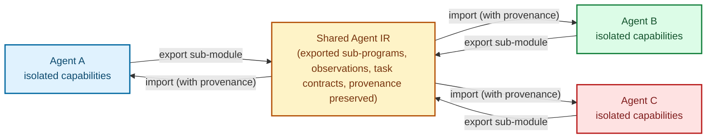

Each agent keeps its own `Capability` and `Memory` space; sharing happens through explicitly exported IR sub-modules, with provenance preserved across the boundary. This point is deliberately under-specified in v0.1 — the risk of freezing a bad coordination abstraction before having a single working agent outweighs the benefit of specifying it early.

---

## 11. Rust implementation architecture

This is what exists, not what is planned. Every crate below builds, is documented, and is covered by the test suite described in §18.

```
Agent-IR/
├── crates/
│   ├── ir-core/     Module/Region/Block/Operation/Value, types, effects,
│   │                capabilities, provenance, diagnostics, builder, printer
│   ├── dialects/    the six v0.1 dialects as data: arity, required attributes,
│   │                and which effect classes each operation may declare
│   ├── parser/      lexer and recursive-descent parser for the printed syntax
│   ├── analysis/    dominance, use map, effect summaries, dependency graph
│   ├── verifier/    the two rejection points of §4: invariants I1-I5, then
│   │                capabilities and approvals
│   ├── passes/      the §5 passes and the fixpoint pass manager
│   ├── lowering/    the §6.4 table, the §9.1 cost model, the §15 scheduler
│   ├── runtime/     event log, state, ledger, checkpoints, recovery, executor
│   └── agent-ir/    the facade crate and the `agent-ir` command line driver
└── examples/        `.air` programs that are compiled, verified and run by the
                     tests, and are asserted to be byte-for-byte canonical
```

*(Corrected by the implementation: the draft listed `pass-manager` and `lowering/openclaw`, `lowering/langgraph` as separate crates. The pass manager is forty lines and lives with the passes; the framework backends are phase 10 and do not exist yet, so they are not listed as if they did. A `Backend` trait is what they will implement.)*

Core structures:

```rust
pub struct Value {
    pub id: ValueId,
    pub name: Option<String>,
    pub ty: Type,
    pub provenance: Provenance,
    pub def: ValueDef,
}

pub struct Operation {
    pub id: OperationId,
    pub name: OpName,
    pub literal: Option<String>,
    pub operands: Vec<ValueId>,
    pub results: Vec<ValueId>,
    pub attributes: Attributes,
    pub effect: Effect,
    pub regions: Vec<RegionId>,
    pub parent: Option<BlockId>,
    pub erased: bool,
}

pub trait Pass {
    fn name(&self) -> &'static str;
    fn description(&self) -> &'static str;
    fn run(&self, module: &mut Module) -> PassReport;
}

pub trait Backend {
    fn name(&self) -> &'static str;
    fn lower(&self, module: &Module, op: OperationId) -> Result<RuntimeTarget, Diagnostic>;
}
```

Everything lives in arenas owned by the `Module` and refers to itself by index. Erasing an operation leaves a tombstone rather than shifting the arena, so ids stay valid for the whole compilation and analyses can use dense side tables.

---

## 12. Roadmap

| Phase | Goal | Status | What closes it |
|---|---|---|---|
| 0. Research/spec | This document, stabilized by critical review | **done, open to review** | External review by 2-3 peers is still outstanding |
| 1. Minimal IR | `ir-core` and the dialect registry | **done** | A module can be built, printed and re-read |
| 2. Parser/Printer | The syntax of §3.3 | **done** | `print(parse(f)) == f` asserted for every example |
| 3. Verifier | Invariants I1-I5, then capabilities | **done** | A negative case per invariant, plus positives so a verifier cannot pass by rejecting everything |
| 4. Analysis | Dominance, uses, effects, dependencies | **done** | Effect summaries look through regions, so a `#pure` loop over a deletion is not treated as pure |
| 5. First passes | Dead Action Elimination, Parallelization, Deduplication | **done** | Optimized and unoptimized runs produce the same effects and the same answer |
| 6. Runtime | Executor and the generic lowering | **done** | The §3.3 program runs end to end and returns the right candidate |
| 7. Persistence/Recovery | Event log, checkpoints, ledger, recovery | **done** | The §16 scenario: 40 candidates, a crash after the 15th write, resume, 40 writes total |
| 8. Benchmarks | The protocol of §9.4 | **not started** | Published results, negative ones included. No performance claim appears in this document until then |
| 9. SDK | Rust API and a command line driver | **partly** | Rust and `agent-ir` exist; the Python SDK does not |
| 10. Multi-backends | Lowering to OpenClaw / LangGraph | **not started** | The `Backend` trait is the seam; one implementation exists |
| 11. Ecosystem | Documentation, governance, contributions | **not started** | An RFC process before the spec drifts |

The honest reading of this table: the compiler and the runtime work, and **nothing about performance has been measured**. Phase 8 is the one that would let this project make a claim, and until it runs, §9.1's coefficients are placeholders and §13.1's latency figure is arithmetic rather than evidence.

---

## 13. Full compilation example — before / after

### 13.1 Simple agent

Goal: "Inspect the model and the hardware, then profile them."

**IR₀ — initial plan proposed by the LLM (sequential, unoptimized):**

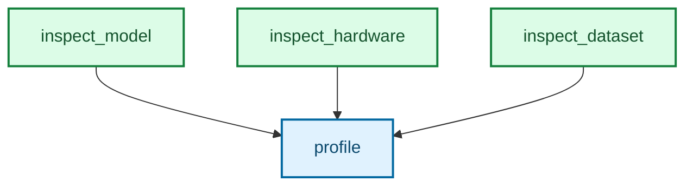

The LLM proposed an implicit sequential chain (emission order = execution order), without expressing any parallelism.

**Dependency analysis:** `inspect_model`, `inspect_hardware`, `inspect_dataset` all read the same host and none of their results is consumed by another — only `profile` depends on all three. Reads never conflict with reads, so I3 is satisfied and the three may be scheduled together.

*(Corrected by the implementation: the draft called these three `Pure`. They inspect a machine, so they are `ReadExternal` — §2.2's own warning is that an operation like `search_web` "looks pure but may have a cost". Declaring them honestly does not weaken the example: the three still parallelize, because two reads of the same scope do not conflict.)*

**IR₁ — after the *Parallelization* pass (condition I3 satisfied: no `WriteExternal` conflict):**

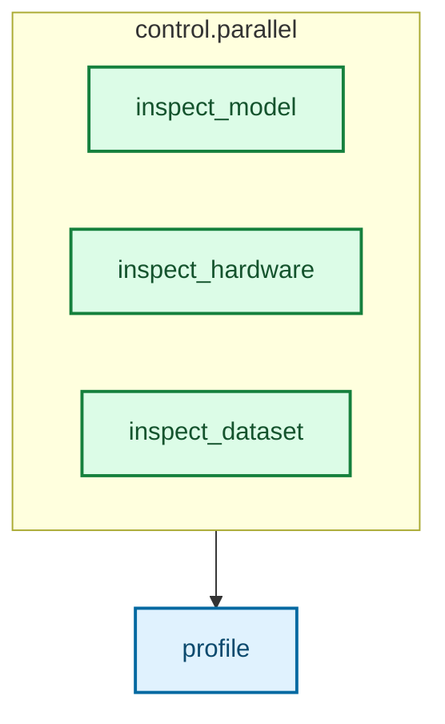

Expected gain (to be measured, §9.4): latency ≈ `max(t_A, t_B, t_C)` instead of `t_A + t_B + t_C`. No token change here — this is a latency gain, not an LLM cost gain.

Run it:

```console
$ agent-ir opt examples/simple_agent.air --report
2 round(s), 5 edit(s)
  parallelization: created 2 rewrote 3
    note[parallelization] at op6: grouped 3 adjacent operations with no dependency and no effect conflict

$ agent-ir plan examples/simple_agent.air
estimated: 0 tokens (0 in / 0 out), 0 llm call(s), 4 tool call(s), 503 ms

batch 0
  control.parallel  →  runtime.parallel
    concurrently:
      batch 0 (3 concurrent)
        agent.action "inspect_model"     →  runtime.tool_call(tool = "inspect_model")
        agent.action "inspect_hardware"  →  runtime.tool_call(tool = "inspect_hardware")
        agent.action "inspect_dataset"   →  runtime.tool_call(tool = "inspect_dataset")
```

The 503 ms is the cost model of §9.1 applied to placeholder coefficients: three 250 ms reads counted once because they are concurrent, plus one more, plus the builtins. It is arithmetic, not a measurement, and §9.4 is where it gets checked against a real runtime.

### 13.2 Complex agent — candidate selection loop with observation

Picks up the example from §3.3 (`optimize_inference`). Full trace of one session:

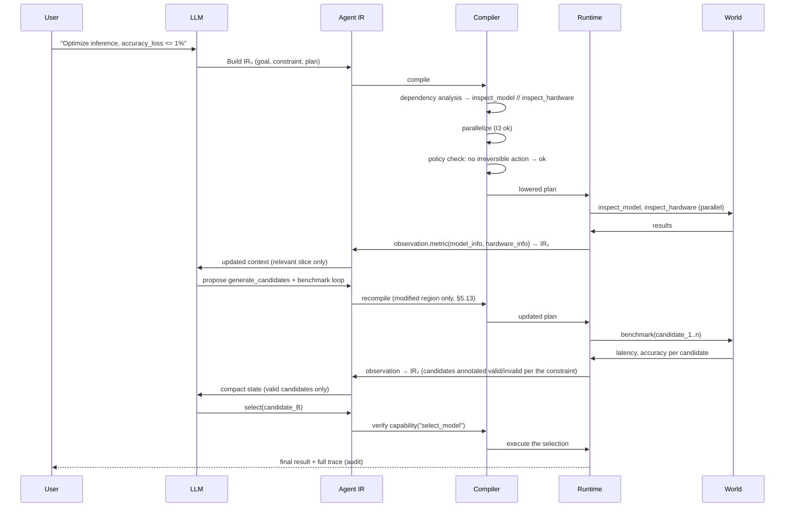

The point to note: at every turn, the LLM never sees the full history again — only the relevant *slice* computed by the compiler (§5, Context Slicing), with the caution stated in §5.1.

---

## 14. Verification model

The verifier runs in two distinct phases, matching the two rejection points of the pipeline (§4):

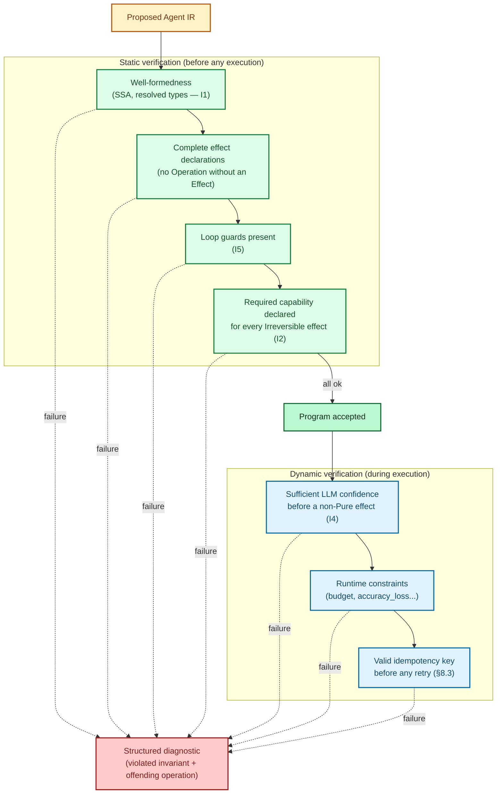

**Why separate static and dynamic:** a program can be well-formed and authorized at compile time (static) yet become invalid at execution time if an observation changes the state (e.g. a candidate exceeds `accuracy_loss` after benchmarking — that was not decidable before actually running it). The dynamic verifier therefore runs on every new observation, not just once at the start.

**Structured diagnostic (format):**

```
Diagnostic {
    invariant: "I2",
    operation: OperationId(42),
    message: "effect=Irreversible without a matching capability",
    suggestion: "add agent.verify before this operation, or request human_approval",
}
```

---

## 15. Scheduling model

The scheduler takes the optimized plan (post Pass Manager) and produces a concrete execution order under the budget constraints of §9.1.

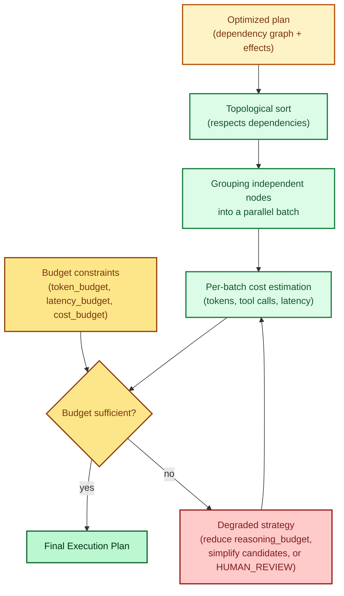

**A note on rigor:** the scheduler solves a combinatorial problem (scheduling under multi-objective constraints). In v0.1 we are not aiming for the optimum — a greedy heuristic (batch independent nodes in topological order, estimate the cost, degrade on overrun) is enough to validate the full loop. A real solver (e.g. constraint programming) is a research problem in its own right, out of scope for v0.1.

---

## 16. Long-running example — checkpoint and recovery

Scenario: an agent runs a benchmarking task over 40 candidates, spread across several hours, with a crash in the middle.

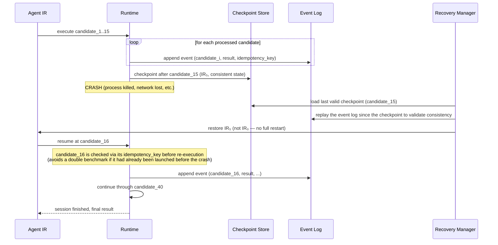

Key points illustrated:

- **No "start over from scratch"**: recovery starts from the last consistent checkpoint (§8.6), not from `IR₀`.
- **Idempotency key** (§8.3) protects against a double effect if the crash happened right after a `WriteExternal` whose acknowledgement was lost.
- **Append-only Event Log** serves both as the source of truth for recovery and as an audit trail (§6, debugging).

This scenario is a test, not a diagram. `examples/durable_benchmark.air` is compiled, crashed after the fifteenth recorded result, and resumed; the test asserts that forty writes happened in total, that fifteen were skipped rather than repeated, and that all forty benchmark *reads* were simply re-run — because `ReadExternal` licenses exactly that, and `WriteExternal` does not.

The asymmetry is the point. Recovery here is replay, and it is the effect system that makes replay sound: a step the compiler proved replayable is re-run, a step it proved otherwise is memoized under its key. Without §2.2 there would be no principled way to know which is which.

---

## 17. Long-term vision

```
Models / Frameworks / Applications
              │
      Universal Agent IR
              │
Compiler / Optimizer / Verifier / Scheduler
              │
      Multiple Runtimes
```

---

## 18. The reference implementation

A Rust workspace implementing §2 through §16. Requires Rust 1.90 or newer.

```console
$ git clone https://github.com/rustnew/Agent-IR && cd Agent-IR
$ cargo test --workspace
$ cargo run -p agent-ir -- --help
```

### 18.1 The command line

One subcommand per stage of §4, so each rejection point can be looked at on its own.

```console
$ agent-ir verify examples/optimize_inference.air
examples/optimize_inference.air: accepted

$ agent-ir verify bad.air
error[I2] at op3: `tool.call` declares #irreversible<db> without a preceding
                  `agent.verify` naming a capability that covers it
  help: insert `agent.verify {capability = "..."}` before this operation, or
        route it through human approval

$ agent-ir opt examples/simple_agent.air --report      # what the §5 passes did
$ agent-ir plan examples/durable_benchmark.air         # the §15 schedule and its cost
$ agent-ir run examples/simple_agent.air \
      --tools examples/tools/inspect.json \
      --arg '"resnet"' --arg '"a100"' --arg '"imagenet"' --trace
#0            started inspect_and_profile from IR0
#1    op1  inspect_model [#read_external<host>]
#2    op2  inspect_hardware [#read_external<host>]
#3    op3  inspect_dataset [#read_external<host>]
#4    op4  profile [#read_external<host>]
#5            finished: {latency_ms: 41.2, throughput: 2400}

result: {latency_ms: 41.2, throughput: 2400}
4 effect(s) reached the world, 0 replayed from the ledger
```

`agent-ir dialects` prints the operation table of §3.2 with its effect column; `agent-ir passes` prints the pipeline and each pass's validity condition; `agent-ir fmt --check` is what keeps the examples in this document identical to what the compiler emits.

### 18.2 What the tests establish

208 tests, and the ones worth naming are the ones that would catch a wrong claim rather than a typo.

| Property | Where | What would break if it failed |
|---|---|---|
| `print(parse(f)) == f` for every example | `parser/tests/round_trip.rs` | This document would describe a syntax the compiler does not accept |
| A negative case per invariant, plus positives | `verifier/tests/invariants.rs` | A verifier can pass every negative test by rejecting everything |
| Each pass declines when its §5 condition fails | `passes/src/*.rs` | An unread payment would be deleted as dead code |
| Every pass re-verifies the module it produced | `passes/`, `agent-ir/src/lib.rs` | A pass could hand the runtime a program the compiler already promised was safe |
| Optimized and unoptimized runs agree | `runtime/tests/durability.rs` | §12 phase 5's success criterion, and the whole premise of §5 |
| Crash at 15 of 40, resume, 40 writes total | `runtime/tests/durability.rs` | §8.3 and §16 would be diagrams rather than behaviour |
| A `#pure` loop over a deletion is not pure | `analysis/src/effects.rs` | Every §5 condition that reads an effect would read the wrong one |

CI additionally runs `rustfmt`, `clippy` with warnings denied, `rustdoc` with warnings denied, and `agent-ir verify` over every checked-in example.

### 18.3 What is not there

Named plainly, because §0 rule 1 applies to completeness as much as to performance:

- **No measurements.** Phase 8 of §12 has not run. The cost coefficients are placeholders and the latency figures in §13.1 and §18.1 are arithmetic over those placeholders.
- **The reference executor is single-threaded.** A batch is a set of steps the scheduler *proved* may run together; exploiting that is a backend's job, and this one does not. The concurrency is in the plan, not in the process.
- **Fifteen of the eighteen §5 passes are specification only.** Three are implemented.
- **One backend.** The `Backend` trait is the seam for phase 10; only the generic runtime implements it.
- **No Python SDK, no `policy` or `communication` dialect, no `control.branch`.**
